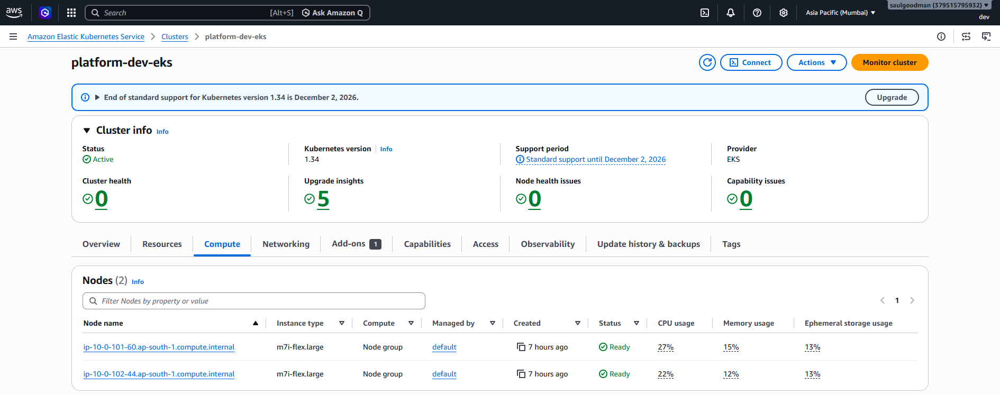
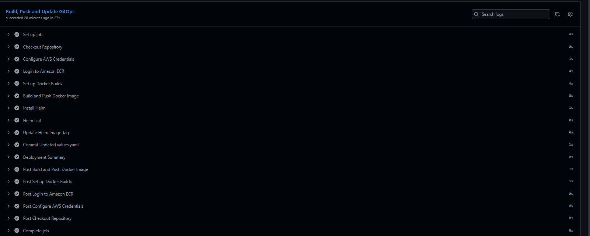
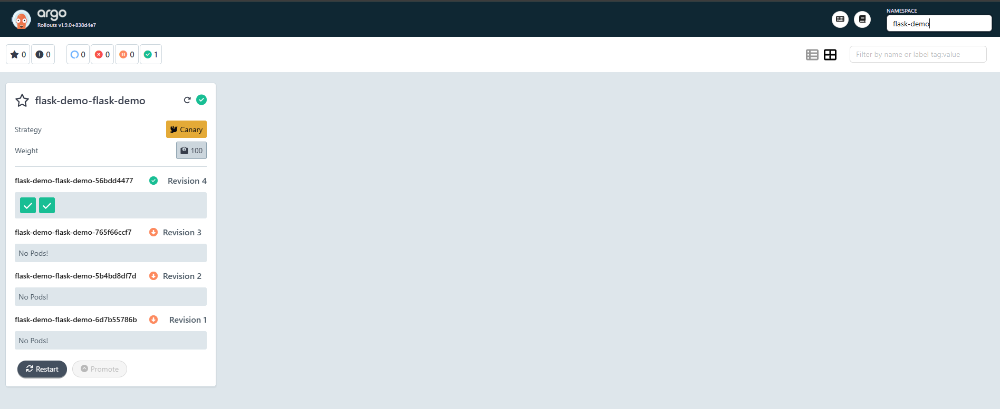
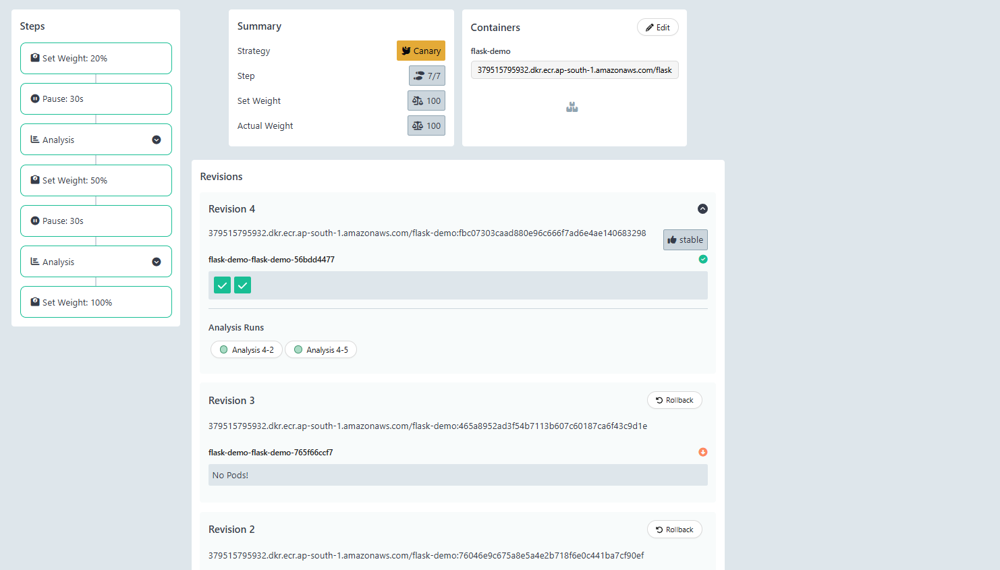

# 🚀 Flask Progressive Delivery Demo

> Enterprise-grade GitOps Progressive Delivery using **Argo CD**, **Argo Rollouts**, **GitHub Actions**, **Helm**, **Prometheus**, **Grafana**, and **Amazon EKS**.


---

# 📖 Overview

This repository demonstrates an enterprise-grade GitOps Progressive Delivery workflow on Amazon EKS.

The application is packaged with Helm, deployed using Argo CD, released progressively with Argo Rollouts, monitored using Prometheus, visualized with Grafana, and built automatically through GitHub Actions.

New versions are deployed as Canary Releases. During rollout, Prometheus continuously evaluates application metrics. If the configured threshold is violated, Argo Rollouts automatically aborts the deployment and restores the previous stable version.

---

# 🏗️ Architecture

<p align="center">

</p>

---

# 🎯 Features

- Flask REST API
- Dockerized Application
- Helm-based Kubernetes Deployment
- GitHub Actions CI/CD
- Amazon ECR Image Publishing
- GitOps with Argo CD
- Canary Deployments
- Automated Metric Analysis
- Automatic Rollback
- Prometheus Monitoring
- Grafana Dashboards
- Kubernetes ServiceMonitor

---

# 📂 Repository Structure

```text
flask-rollouts-demo/
├── .github/
├── app/
├── argocd/
├── docs/
├── helm/
├── Dockerfile
├── requirements.txt
├── run.py
├── VERSION
├── README.md
└── LICENSE
```

---

# 🛠 Technology Stack

| Category | Technology |
|-----------|------------|
| Language | Python (Flask) |
| Containerization | Docker |
| Kubernetes | Amazon EKS |
| Helm | Helm |
| GitOps | Argo CD |
| Progressive Delivery | Argo Rollouts |
| Monitoring | Prometheus |
| Dashboards | Grafana |
| CI/CD | GitHub Actions |
| Registry | Amazon ECR |

---

# 📸 Screenshots

## Architecture


## Amazon EKS



## GitHub Actions



## Argo CD


## Argo Rollouts



## Rollout Analysis



---

# 👨‍💻 Author

**Murali Krishna**

Cloud & DevOps Engineer

AWS • Terraform • Kubernetes • Docker • GitHub Actions • Argo CD • Argo Rollouts • Prometheus • Grafana

---

# 📄 License

MIT License
